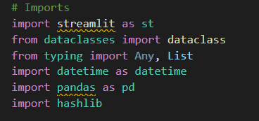
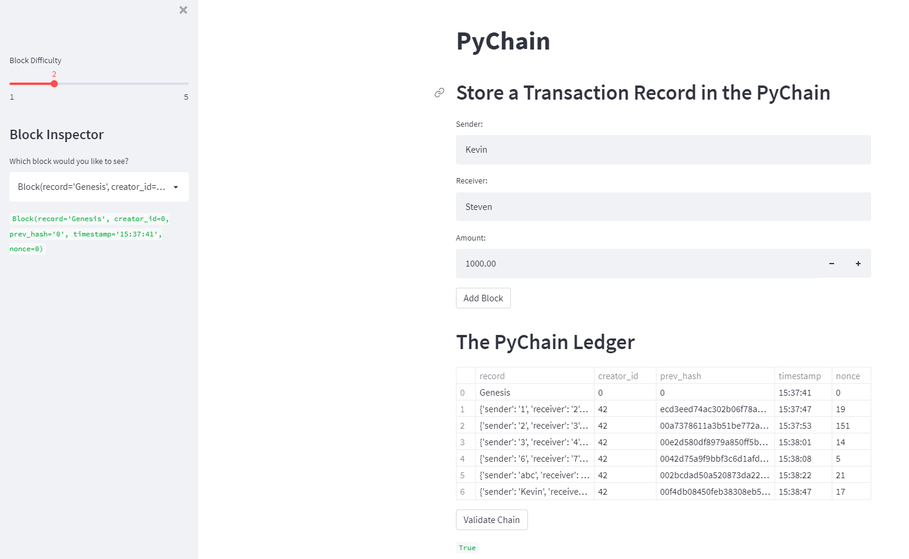
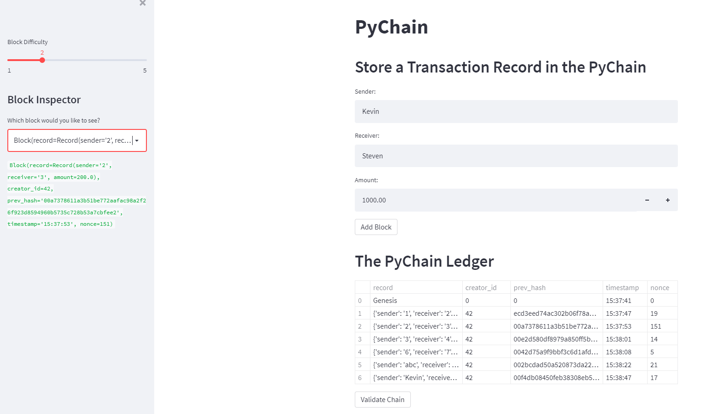

# fintech_challenge_18
This project consists of finishing a blockchain-based ledger system which includes a user-friendly streamlit interface. The focus on this project is to create a ledger which
facilitates the transfer of money between senders and recievers and to test the validity of the data in the ledger.

---
## Technologies
This program requires StreamLit
The application is a .py file which can be viewed by typing 'streamlit run pychain.py' into your terminal.

Here are the other necessary libraries to import:

---
## Usage
Once StreamLit is running we can see areas different to input transaction data. We can edit the sender, receiver, and amount. After we set our desired vlaues we can use the
validate chain button in order to verify our chain's data.

Another feature of our StreamLit page is the block inspector. Found on the left side of the screen, the block inspector allows us to inspect the data of any block on the
blockchain.

---
## Contributors
Kevin Gross

---
## License
This program is covered under the MIT license.